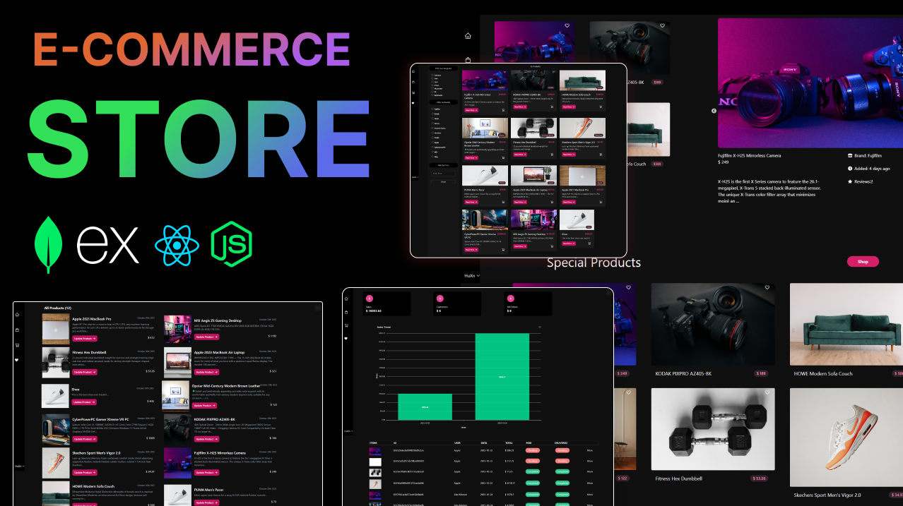

# MERN E-Commerce Store

A full-stack e-commerce application built with the MERN stack, featuring customer shopping flows, admin operations, and end-to-end order management.

**Maintained by:** Sakshi  
**Role:** Full-Stack Developer

## Project Summary

This project demonstrates production-style e-commerce architecture with a React frontend, RESTful Express API, MongoDB data modeling, JWT-based authentication, and role-based admin controls.

It includes the complete commerce lifecycle:

- Product discovery and filtering
- Cart and checkout flow
- Order placement and payment status tracking
- User profile and order history
- Admin dashboards for products, users, categories, and orders

## Core Features

- Secure authentication with JWT + HTTP-only cookies
- Role-based access control (`user` and `admin`)
- Product catalog with:
  - Category support
  - Latest and top product feeds
  - Product review system
  - Server-side filtering endpoint
- Shopping cart and shipping workflow
- Order management:
  - Create order
  - View personal order history
  - Mark orders paid/delivered
  - Aggregate order and sales stats
- PayPal client integration endpoint
- Image upload pipeline for product assets

## Tech Stack

- **Frontend:** React, Vite, Redux Toolkit, React Router, Tailwind CSS
- **Backend:** Node.js, Express.js, MongoDB, Mongoose
- **Auth & Security:** JWT, bcrypt, cookie-parser
- **Payments:** PayPal integration
- **Utilities:** Multer, Express Formidable, React Toastify

## Architecture

- `frontend/`: SPA client with route guards, Redux state, API slices, and admin/user views
- `backend/`: Express API with controllers, route modules, middleware, models, and DB config
- Root scripts coordinate backend runtime and frontend dev server

## Getting Started

### 1. Clone and install dependencies

```bash
git clone <your-repo-url>
cd MERN-E-Commerce-Store
npm install
cd frontend && npm install && cd ..
```

### 2. Configure environment

Create a root `.env` file:

```env
PORT=5000
MONGO_URI=mongodb://127.0.0.1:27017/sakshiStore
NODE_ENV=development
JWT_SECRET=your_jwt_secret
PAYPAL_CLIENT_ID=your_paypal_client_id
```

### 3. Run the app

Start backend (from project root):

```bash
npm run backend
```

Start frontend (in a second terminal):

```bash
cd frontend
npm run dev
```

- Frontend: `http://localhost:5173`
- Backend API: `http://localhost:5000`

## API Overview

Main API groups exposed by the backend:

- `/api/users` - auth, profile, and admin user management
- `/api/products` - CRUD, reviews, top/new feeds, product filtering
- `/api/category` - category CRUD and retrieval
- `/api/orders` - checkout, user orders, payment/delivery updates, analytics
- `/api/upload` - file uploads
- `/api/config/paypal` - PayPal client configuration

## Resume-Ready Highlights

- Implemented scalable REST APIs with route-level auth and admin authorization.
- Built modular Redux state and API slices for predictable frontend data flow.
- Designed a complete commerce funnel from catalog browsing to order completion.
- Added operational admin tooling for catalog, users, and fulfillment workflows.

## Project Preview



## License

This project is available for personal learning and portfolio use.
